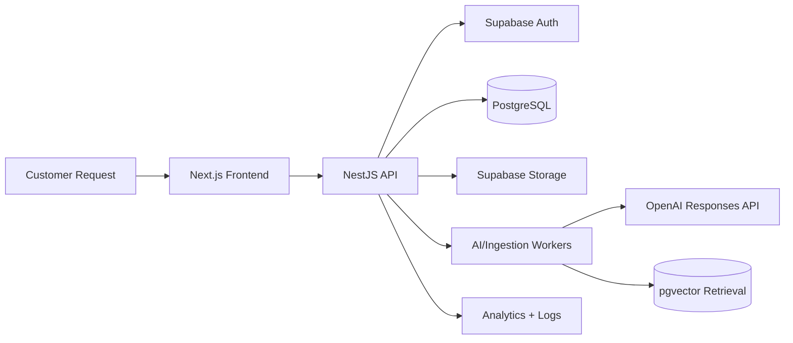

# Architecture

## Architectural Style

- Frontend: Next.js 16 App Router with feature-based UI modules
- Backend: NestJS modular monolith designed for future service extraction
- Data: PostgreSQL on Supabase with Prisma ORM and pgvector
- Auth: Supabase Auth with local profile and membership projection
- AI: OpenAI Responses API with structured outputs and RAG

## Core Principles

- Clean architecture inside each backend module
- Thin controllers, explicit use cases, repository-backed persistence
- Shared contracts for validation, AI outputs, and API responses
- Fail-safe AI orchestration with confidence gating and escalation

## High-Level Components

## Backend Modules

- `auth`: session validation, RBAC guards, membership resolution
- `users`: user profile and organization membership
- `tickets`: intake, message threads, assignments, lifecycle
- `knowledge-base`: ingestion, chunking, embeddings, retrieval metadata
- `ai-agent`: triage orchestration, response generation, follow-up generation, escalation
- `analytics`: operational and AI-quality metrics
- `logs`: AI audit logs and human override history
- `settings`: organization-scoped AI and retrieval configuration

## Request Processing Flow

1. Customer submits ticket
2. Ticket service stores request and emits processing job
3. AI agent executes triage pipeline
4. Decision engine selects response, follow-up, escalation, or urgent routing
5. Outcome is persisted with logs, evidence, and notifications

## Frontend Strategy

- Route groups per product module
- Server components for data-heavy views
- Client components only for interactive islands
- React Query for server-state caching
- Zustand for lightweight local UI state
- React Hook Form plus Zod for typed forms

## Deployment Topology

- Vercel hosts frontend
- Render hosts NestJS API and worker processes
- Supabase hosts PostgreSQL, Auth, and Storage
- GitHub Actions validates and deploys per environment
