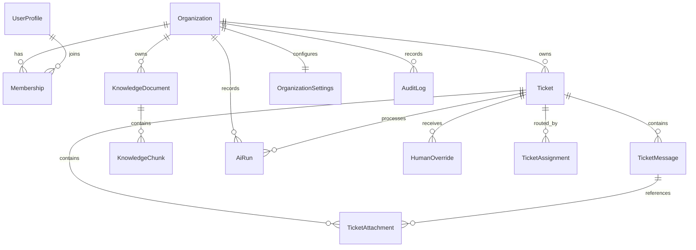

# Database Design

## Design Goals

- Support multi-tenant SaaS operation
- Preserve normalized operational data
- Separate AI run logs from ticket state
- Keep retrieval data queryable and auditable

## Core Entities

- `Organization`: tenant boundary
- `UserProfile`: local projection of Supabase-authenticated user
- `Membership`: organization role mapping
- `Ticket`: support case aggregate root
- `TicketMessage`: ticket conversation timeline
- `TicketAttachment`: stored files linked to tickets or messages
- `KnowledgeDocument`: uploaded source asset
- `KnowledgeChunk`: retrievable text chunk with embedding vector
- `AiRun`: every AI processing execution and outcome
- `HumanOverride`: manual correction of AI decisions
- `TicketAssignment`: operator routing history
- `OrganizationSettings`: AI and retrieval configuration
- `AuditLog`: security and domain event audit trail

## ER Diagram

## Indexing Strategy

- Composite indexes on `(organizationId, status, createdAt)` for ticket queues
- Composite indexes on `(organizationId, priority, createdAt)` for urgent worklists
- Unique indexes on external identity fields and document checksum
- Full-text or trigram support for duplicate candidate search
- Vector index on `KnowledgeChunk.embedding`

## Constraints

- Every operational record is organization-scoped unless globally unique by design
- Membership uniqueness is enforced per `(organizationId, userId)`
- One organization settings row per organization
- AI run logs are append-only
- Human overrides must preserve original and new values
